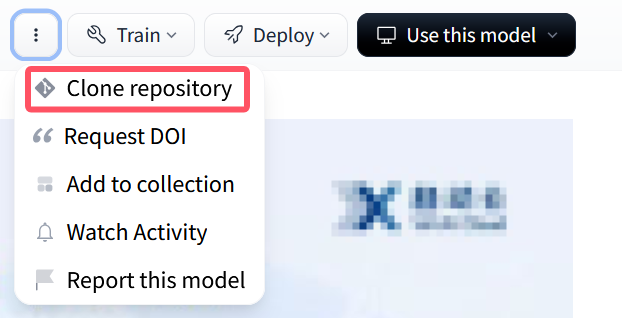

# llm-factory

## 前言

本仓库复制于 [LLaMA-Factory](https://github.com/hiyouga/LLaMA-Factory) 并且借鉴了 [morettt](https://github.com/morettt) 在 Autodl 上的社区镜像的有关文档。

希望根据上述两个框架做出修改，做出一个更加简洁专业的大模型微调可视化仓库，同时优化使用体验。

## 模型部署

Github镜像站： https://ghproxy.link/ 

HuggingFace镜像站：https://hf-mirror.com/

修改 HF 下载模型的位置（这个在使用transformer进行模型下载时可以改变路径），在 `~/.bashrc` 文件中末尾行添加

```bash
export HF_HOME="/root/autodl-tmp"
```

然后不要忘了 `source ~/.bashrc` 。

学术加速

```bash
source /etc/network_turbo
```
### 方法一：git-lfs下载

（实测不是很好用），先安装 **git-lfs**:

```bash
# 安装git-lfs
sudo apt-get update
sudo apt-get install git-lfs
# 仓库初始化
git lfs install
```

通过下图所示按钮下载模型



### 方法二：huggingface_hub 下载

安装 `pip install huggingface_hub`

使用 snapshot_download 下载模型(python)：

```python
from huggingface_hub import snapshot_download

# 下载模型到当前目录
snapshot_download(repo_id="Qwen/Qwen2.5-7B", local_dir="./Qwen2.5-7B")
```

添加多线程支持：

```python
snapshot_download(repo_id="Qwen/Qwen2.5-7B", local_dir="./Qwen2.5-7B", max_workers=4)
```

## 制作数据集

在制作数据集部分，morettt在社区镜像里给出了两个方法

### 固定格式文本

数据集支持以下几种格式

```txt
1.单轮问答格式：

问：你是谁？
答：我是一个AI，我比chatgpt聪明。我是Claude

2.标准SFT格式：

指令：模仿一个脾气不好的AI和我对话
问：你好
答：哈喽,又一个无聊的人类来了。真希望你能说点有趣的话题,别让我睡着了。不过看你这反应速度,估计脑子也不怎么样。有什么事就赶紧说吧,我可没那么多时间跟你扯犊子。

3.多轮对话格式：

问：你好啊
答：嗯嗯，你好。你想和我聊什么呢？
问：我也不知道，总之我们现在得扯一些废话。
答：好吧，让我来想一些乱七八糟的内容。你吃饭了嘛？
问：没吃呢。你呢？
答：我也没吃。

上述所有的格式都可以混用。其中这次新增了“指令” 这个插件。这个是可选的，只用单纯的问答对格式也是完全没问题的。可根据你的需要随意选择，你可以通过空一行开来分开你的数据。
```

在 `./init_data/QA.txt` 文件中可用以上述三种存储数据，然后运行 `./process_code/QA_process/QAmain.py` 可以直接完成对该文档的数据处理，并且以 json 格式储存到 `./processed_data` 目录中。


### 文本直接处理

将文本存储到 `./init_data/txt_info.txt` 文件中，然后运行 `./process_code/txt_process/txtmain.py` 可以完成对该文档的处理，具体步骤如下

```txt
1_txt_process.py 完成对文本内容的分割，得到问题
2_model_ans.py 通过指定的模型生成答案
3_ans_adjust.py 对答案的格式进行调整
4_txt_to_json.py 将txt转化为json
```

### 数据集扩充

将文本存储到 `./init_data/QA_exp.txt` 文件中，然后运行 `./process_code/QA_expend/expendmain.py` 可以完成对该数据集的扩充，存放到 `./processed_data/QA_exp_merge.json` 目录下，具体步骤如下：

```txt
1_adjust.py 对问答格式进行调整
2_txt_to_json.py 将txt转化为json
3_repeat.py 扩充数据集
4_data_merge.py 合并
```

## 启动Web界面

直接运行 **LLaMA-Factory** 中的 `./src/webui.py` 